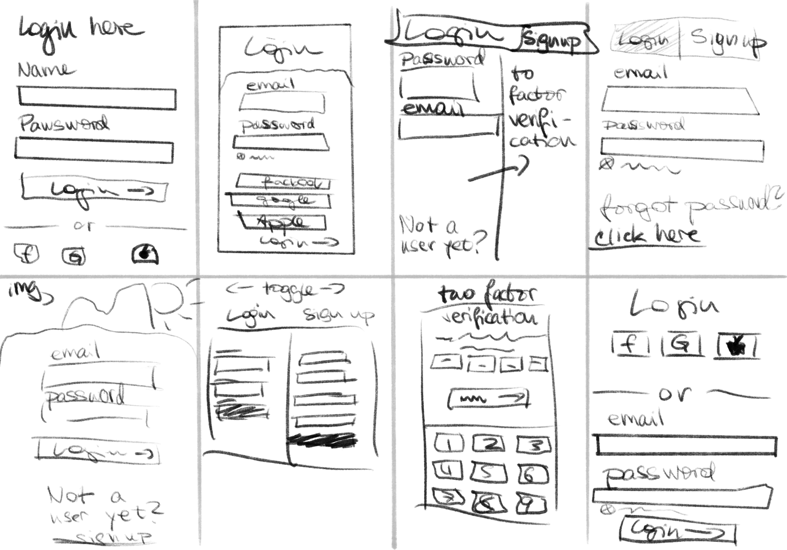
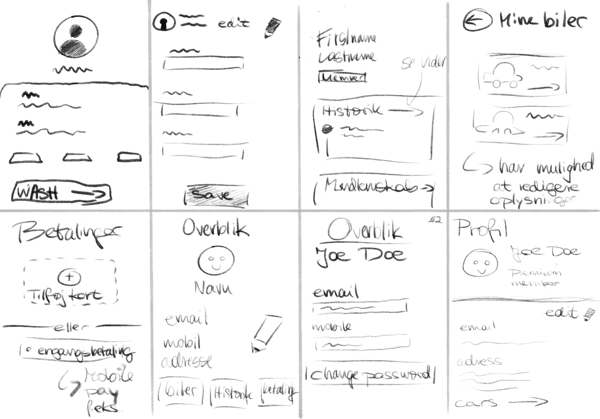
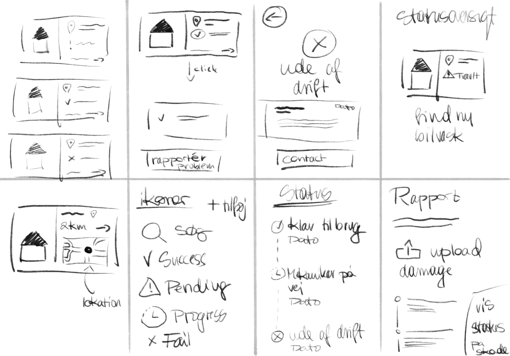
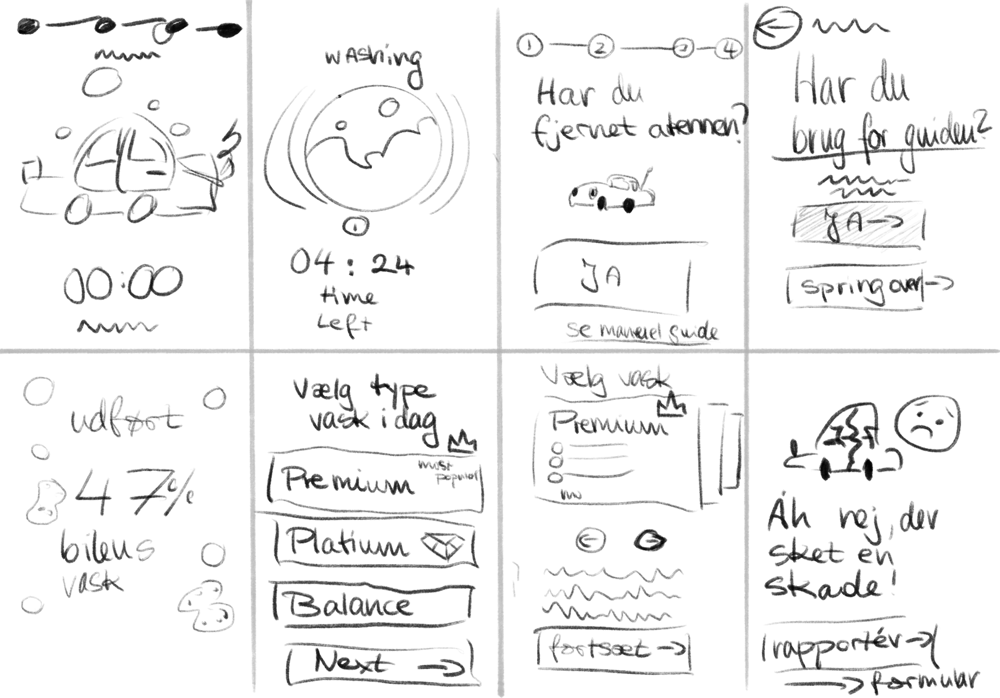

# Wash World 2.0


A web app for Wash World car wash customers: sign up for a membership, manage your cars and profile, find wash locations on a map, and follow wash guides.

<details>
<summary>Design mockups</summary>

| Login / Sign-up | Profile & Cars | Status view | Wash process |
|---|---|---|---|
|  |  |  |  |

</details>

The repo is a monorepo with two parts that each run in Docker:

| Folder | What | Stack | Runs on |
|---|---|---|---|
| [`frontend/`](frontend) | Web app | Next.js 16, React 19, TypeScript, Tailwind CSS 4, TanStack Query, Mapbox | http://localhost:3000 |
| [`backend/`](backend) | REST API | Flask 3 (Python 3.9), MariaDB 10.6 | http://localhost (port 80) |
| | Database admin | phpMyAdmin | http://localhost:8080 |

## Prerequisites

- [Docker Desktop](https://www.docker.com/products/docker-desktop/)
- A Gmail account with an [App Password](https://myaccount.google.com/apppasswords), for sign-up verification and password-reset emails
- A [Mapbox](https://account.mapbox.com/) public access token, for the location map

## Getting started

### 1. Create the `.env` files

Both apps read their settings from a `.env` file. These files are git-ignored, so you must create them from the examples:

```bash
cp backend/.env.example backend/.env
cp frontend/.env.example frontend/.env
```

Then fill in the values that can't be left as defaults:

**`backend/.env`**

| Variable | Value |
|---|---|
| `DB_HOST`, `DB_USER`, `DB_PASSWORD`, `DB_NAME` | Keep the defaults. They match `backend/docker-compose.yml`. `DB_HOST` must be `mariadb` (the service name), not `localhost`. |
| `JWT_SECRET_KEY` | A long random string: `python -c "import secrets; print(secrets.token_hex(32))"` |
| `SENDER_EMAIL` | The Gmail address that sends emails |
| `SENDER_EMAIL_PASSWORD` | The 16-character Gmail **App Password** (not the normal Gmail password) |
| `FRONTEND_URL` | `http://localhost:3000`. Used for CORS and must be set, or every request fails. |

**`frontend/.env`**

| Variable | Value |
|---|---|
| `NEXT_PUBLIC_BACKEND_URL` | `http://localhost` |
| `NEXT_PUBLIC_MAPBOX_TOKEN` | Your Mapbox public token (`pk....`) |
| `FLASK_SERVER_SIDE_ONLY` | Used by the `/api/*` rewrite in `next.config.ts`. Must be a full URL, or the build fails. |

> `NEXT_PUBLIC_*` values are bundled into the browser. Never put a secret behind a `NEXT_PUBLIC_` name.

### 2. Start the backend

```bash
cd backend
docker compose up --build
```

This starts three containers: `monorepo_flask` (the API), `monorepo_mariadb` (the database), and `monorepo_phpmyadmin`.

### 3. Set up the database

The first time, import the schema and data:

1. Open phpMyAdmin at http://localhost:8080 (user `root`, password `password`).
2. Select the `wash_world` database.
3. Go to **Import** and upload [`backend/extentions/wash_world.sql`](backend/extentions/wash_world.sql).

This creates all tables and loads the Wash World locations, so you don't need to import `locations_import.sql` separately. It contains the same rows, and importing it again fails with a duplicate-entry error (#1062).

The data is stored in the `mariadb_data` Docker volume, so it survives restarts. To start over with an empty database, run `docker compose down -v`.

### 4. Start the frontend

In a second terminal:

```bash
cd frontend
docker compose up --build
```

Open http://localhost:3000.

The source folder is mounted into the container, so edits reload automatically.

## Project structure

```
backend/
├── app.py                 # Entry point: Flask app, CORS, sessions, blueprints
├── api/                   # Routes, one blueprint per area
│   ├── users.py           # Signup, login, verification, password reset, profile
│   ├── cars.py            # A user's cars
│   ├── locations.py       # Wash locations
│   └── payment.py         # Payment methods (not registered in app.py yet)
├── utils/
│   ├── config.py          # Database connection (reads DB_* from .env)
│   ├── regex.py           # Input validation
│   └── no_cache.py        # No-cache response decorator
├── templates/             # Email templates (verification, forgot password)
├── extentions/            # SQL dumps (wash_world.sql, locations_import.sql)
└── static/uploads/        # Uploaded avatar images

frontend/
├── app/
│   ├── (features)/        # Feature pages: dashboard, login, profile, mycar,
│   │                      #   add_car, locationlist, washprocess, guides, case, ...
│   ├── membership-signup/ # Sign-up flow
│   ├── reset-password/    # Password reset page
│   ├── global/            # Shared components, hooks, store, styles, types
│   └── lib/api.tsx        # All calls to the Flask backend
├── cypress/e2e/           # End-to-end tests
└── dev/                   # Alternative dev Docker setup (no production build)
```

## API endpoints

All endpoints are served by Flask on http://localhost. Auth uses a session cookie, so the frontend sends requests with `withCredentials`.

| Method | Path | Description |
|---|---|---|
| POST | `/api-signup` | Create a user and send a verification email |
| GET | `/api-verify/<key>` | Verify an email address |
| POST | `/api-login` | Log in |
| POST | `/logout` | Log out |
| GET | `/api-user` | Get the logged-in user |
| PATCH | `/api-user` | Update the logged-in user |
| POST | `/api-user/avatar` | Upload an avatar (png/jpg) |
| DELETE | `/delete-user` | Delete the logged-in user |
| POST | `/forgot-password` | Send a password-reset email |
| GET | `/reset-password/<key>` | Check a reset key |
| PATCH | `/reset-password` | Set a new password |
| POST | `/api-create-car` | Add a car |
| GET | `/api-get-cars` | List the user's cars |
| DELETE | `/delete-car/<car_pk>` | Delete a car |
| PATCH | `/restore-car/<car_pk>` | Restore a deleted car |
| POST | `/api-create-location` | Create a location |
| GET | `/api-get-all-locations` | List all locations |
| GET | `/api-get-location/<location_pk>` | Get one location |

## Testing

Cypress end-to-end tests live in `frontend/cypress/e2e`. With both apps running:

```bash
cd frontend
npx cypress open
```

Linting:

```bash
cd frontend
npm run lint
```

## Troubleshooting

| Symptom | Cause and fix |
|---|---|
| Frontend build fails with `Invalid rewrite found` / `destination: "undefined/api/:path*"` | `frontend/.env` is missing. Create it from `.env.example`. |
| `Can't connect to MySQL server on 'localhost:3306'` | `backend/.env` is missing or `DB_HOST` isn't `mariadb`. |
| `TypeError: argument of type 'NoneType' is not iterable` in `flask_cors` | `FRONTEND_URL` isn't set in `backend/.env`. |
| `SMTPAuthenticationError (535) Username and Password not accepted` on signup | `SENDER_EMAIL` / `SENDER_EMAIL_PASSWORD` are wrong. Use a Gmail App Password. |
| `Duplicate entry ... for key 'user_email'` on signup | The user was saved before an earlier email failure. Use another email or delete the row in phpMyAdmin. |
| `#1062 Duplicate entry` when importing `locations_import.sql` | The locations are already loaded by `wash_world.sql`. Skip it. |

After changing `backend/.env`, restart Flask so it reads the new values:

```bash
cd backend
docker compose restart flask-app
```

After changing `frontend/.env`, rebuild the frontend with `docker compose up --build`.
